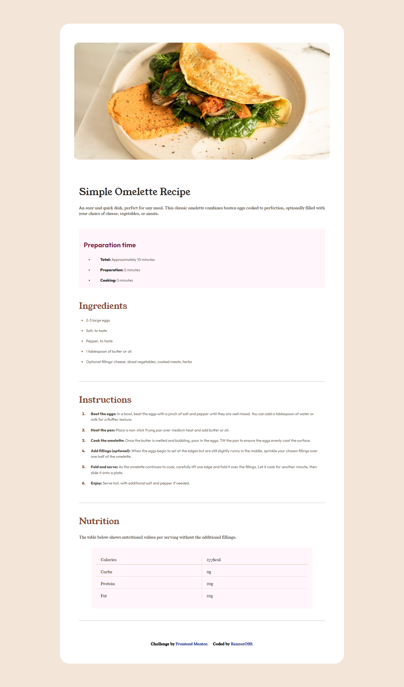

# Frontend Mentor - Recipe Page

Esta es una solución al [desafío de "Recipe Page" en Frontend Mentor](https://www.frontendmentor.io/learning-paths/getting-started-on-frontend-mentor-XJhRWRREZd/steps/66aed04fe2150da4c452cd9e/challenge/start). Los desafíos de Frontend Mentor te ayudan a mejorar tus habilidades de codificación al construir proyectos realistas.

## Tabla de contenidos

- [Descripción general](#descripción-general)
  - [Captura de pantalla](#captura-de-pantalla)
  - [Enlaces](#enlaces)
- [Mi proceso](#mi-proceso)
  - [Construido con](#construido-con)
  - [Lo que aprendí](#lo-que-aprendí)
- [Autor](#autor)

## Descripción general
Este proyecto consiste en una tarjeta de vista previa para la entrada de un blog sobre recetas y está diseñada siguiendo los principios de Mobile-First y con una estructura completamente responsive. El diseño forma parte de un desafío de Frontend Mentor, enfocado en mejorar mis habilidades de maquetación web.

### Captura de pantalla

### Links

- Live Site URL: [Recipe Page](https://renzo2o99.github.io/recipe-page-main/) by [@Renzo2O99](https://github.com/Renzo2O99/)

## Características Principales

### Diseño Responsivo
- Implementa la metodología Mobile-First.
- La tarjeta se ajusta en ancho y disposición, según el dispositivo.
- Uso de etiquetas semánticas para la mejora del SEO en búscadores web.
- Utiliza media queries para adaptar el diseño a diferentes tamaños de pantalla.

### Estructura de la Tarjeta
- Un área de imagen destacada
- La sección de contenido incluye:
  - Categoría del artículo.
  - Fecha de publicación.
  - Título del artículo.
  - Breve descripción.
  - Perfil del autor (imagen y nombre).

### Estilo y Presentación
- Se utiliza una paleta de colores predefinida con variables CSS.
- Se incorpora una tipografía personalizada (Young Serif y Outfit, en concreto).
- Se implementan el uso de etiquetas 
 que funcionan como divisisores entre secciones.

### Optimización y Rendimiento
- Implementación de la API de Google Fonts para el manejo y control de fuentes.
- Implementación de Normalize CSS para la consistencia de estilos entre navegadores.
- Implementación de un archivo base en donde se guardan los estilos más importantes para el sitio web.

## Mi Proceso

### Construido con

- Marcado HTML5 semántico.
- Propiedades personalizadas de CSS.
- CSS Flexbox.
- CSS Grid.
- Flujo de trabajo Mobile-First.

### Lo que aprendí

Puse en práctica mis habilidades en HTML 5 y CSS 3, además de implementar la metodología Mobile-First para el desarrollo del sitio y el uso de CSS Flexbox y CSS Grid.

## Author

- GitHub User - [@Renzo2O99](https://github.com/Renzo2O99)
- Frontend Mentor User - [@Renzo2O99](https://www.frontendmentor.io/profile/Renzo2O99)
# Frontend Mentor - Recipe Page